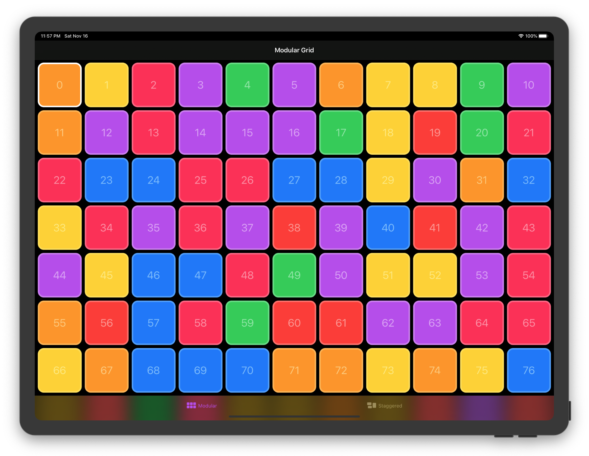

## SwiftUI Grid
SwiftUI Grid view layout with custom styles.

- ZStack based layout (vertical and horizontal)
- Supports all apple platforms
- Custom Styles (ModularGridStyle, StaggeredGridStyle)
- SwiftUI code patterns (StyleStructs, EnvironmentValues)
- Active development for production apps

Open `/Examples/GridExamples.xcodeproj` for more examples for iOS, macOS, watchOS and tvOS

## GridStyles

### ModularGridStyle (Default)

```swift
Grid(colors) {
    Rectangle()
        .foregroundColor($0)
}
.gridStyle(
    ModularGridStyle(columns: 2, rows: .auto(.min(100)))
)
```
<center>

</center>

### StaggeredGridStyle

```swift
Grid(1...69, id: \.self) { index in
    Image("\(index)")
        .resizable()
        .scaledToFit()
}
.gridStyle(
    StaggeredGridStyle(tracks: 5, axis: .horizontal, spacing: 4)
)
```

<center>

</center>

## Preferences
Get item size and position with preferences
```swift
struct CardsView: View {
    @State var selection: Int = 0
    
    var body: some View {
        Grid(0..<100) { number in
            Card(title: "\(number)")
                .onTapGesture {
                    self.selection = number
                }
        }
        .padding()
        .overlayPreferenceValue(GridItemBoundsPreferencesKey.self) { preferences in
            RoundedRectangle(cornerRadius: 16)
                .strokeBorder(lineWidth: 4)
                .foregroundColor(.white)
                .frame(
                    width: preferences[self.selection].width,
                    height: preferences[self.selection].height
                )
                .position(
                    x: preferences[self.selection].midX,
                    y: preferences[self.selection].midY
                )
                .animation(.linear)
        }
    }
}
```

## SDKs
- iOS 13+
- Mac Catalyst 13.0+
- macOS 10.15+
- watchOS 6+
- Xcode 11.0+

## Roadmap
-  Animations
- 'CSS Grid'-like features

## Contibutions
Feel free to contribute via fork/pull request to master branch. If you want to request a feature or report a bug please start a new issue.
